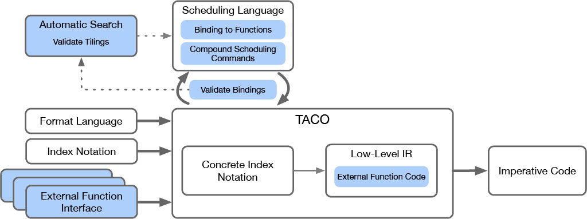

The Mosaic compiler is built on top of
[TACO](https://github.com/tensor-compiler/taco), a domain-specific language
embedded in C++ that computes tensor algebra expressions on sparse and dense
tensors. Mosaic enables users to mix calls to external libraries with code
generated by TACO.


# Build and test Mosaic

Build Mosaic using CMake 3.4.0 or greater:

    $ cd <mosaic-directory>
    $ git submodule update --init
    $ mkdir build
    $ cd build
    $ cmake \
      -DCMAKE_BUILD_TYPE='Release' \
      -DCMAKE_INSTALL_PREFIX="${HOME}" \
      -DBENCHMARK_DOWNLOAD_DEPENDENCIES=ON \
      ../
    $ make -j8

Building Mosaic requires `gcc` 5.0 or newer, or `clang` 3.9 or newer.  You can
use a specific compiler or version by setting the `CC` and `CXX` environment
variables before running `cmake`.


## Running tests
To run all tests:

    cd <mosaic-directory>/build
    make test

Tests can be run in parallel by setting `CTEST_PARALLEL_LEVEL=<n>` in the environment (which runs `<n>` tests in
parallel).

To run the C++ test suite individually:

    cd <mosaic-directory>
    ./build/bin/taco-test

## Running benchmarks 

Run all benchmarks 

    cd <mosaic-directory>/build/bin
    ./taco-bench


You can run a particular benchmark by:

    cd <mosaic-directory>/build/bin
    ./taco-bench --benchmark_filter=<regex>


# Adding New External Functions

Each external function is included like a library with a ```.h``` file. To add external functions to Mosaic, users need
to define a class that provides both the imperative algorithm for code generation and the semantics of the function.
Example headers are implemented in the ```mosaic/include/taco/accelerator_interface``` directory.

To demonstrate how to plug-in new functions to Mosaic, we walk through the process of adding new external functions. To
make our discussion concrete, we consider an example of the
[CBLAS](https://www.intel.com/content/www/us/en/develop/documentation/onemkl-developer-reference-c/top/blas-and-sparse-blas-routines.html)
library, in particular the
[```cblas_saxpy```](https://www.intel.com/content/www/us/en/develop/documentation/onemkl-developer-reference-c/top/blas-and-sparse-blas-routines/blas-routines/blas-level-1-routines-and-functions/cblas-axpy.html#cblas-axpy)
function. The ```cblas_saxpy``` function computes the sum of a vector-scalar product and another vector, and has the
interface:

```void cblas_saxpy (const MKL_INT n, const float a, const float *x, const MKL_INT incx, float *y, const MKL_INT incy);```


For simplicity, we only consider the case where our scalar is 1 i.e.
```cblas_saxpy``` computes the sum of two vectors. In einsum notation, the
semantics of the ```cblas_saxpy``` are given by: ```Y(i) = X(i) + Y(i)```.

The arguments to the ```cblas_saxpy``` function are given by:

1. ```const MKL_INT n```: Length of ```X```, which must be equal to ```Y```.
2. ```const float a```: Scalar to multiply  ```X```, in our case 1.
3. ```const float *x```: Pointer to storage of ```X```.
4. ```const MKL_INT incx```: Stride to access next element of ```X```.
5. ```const float *y```: Pointer to storage of ```Y```.
6. ```const MKL_INT incy```: Stride to access next element of ```Y```.

Now, to define the external function interface (as defined in Section 3), first
we must first define a class that inherits from the pure virtual
```AbstractFunctionInterface``` class defined in
```mosaic/include/taco/accelerator_notation/accel_interface.h```. We elide some details to keep our
discussion short, but to look at the complete definition, refer to the
```Saxpy``` class defined in
```mosaic/include/taco/accelerator_interface/cblas_interface.h```.

First, we define the semantic description of the functions:

```C++
taco::AcceleratorStmt getStmt() const override{ return x(i) = x(i) + y(i);}
```
Here, ```x``` and ```y``` are of private variables of type ```TensorObject```.
The ```TensorObject``` extends TACO tensors to support dynamic orders. To see
an example of writing language capability statements that use dynamic tensors,
refer to ```mosaic/test/test-accelerate-notation.cpp```.

Next, we define the arguments of our function:

```C++
std::vector<Argument> getArguments() const override
                        {return 
                            {new DimArg(i),
                            new LiteralArg(Datatype(taco::UInt32), 1),
                            new TensorObjectArg(y),
                            new LiteralArg(Datatype(taco::UInt32), 1),
                            new TensorObjectArg(x),
                            new LiteralArg(Datatype(taco::UInt32), 1)};
                        }
```
We use special objects like ```DimArg```, ```LiteralArg```,
```TensorObjectArg``` to pass in tensor metadata and literal arguments. More
types of arguments are defined in
```mosaic/include/taco/accelerator_notation/accel_interface.h```.

Finally, we define the return type and function name:

```C++
std::string getReturnType() const override {return "void";}
std::string getFunctionName() const override{return "cblas_saxpy";}
```
Note that we also define a pass through checker function since we do not need to
specify any other constraint's on the ```cblas_saxpy``` function.

```C++
bool checkerFunction(IndexStmt stmt) const override{return true;}
```

*To see a more complicated example, refer to the ```tblis_interface.h```*.
Here, one can note the ```callBefore``` and ```callAfter``` functionality in
action. One can also see how library-specific objects can be used as arguments
through the use of ```DeclVar```.

## Scheduling a Call to cblas\_saxpy

To ```map``` or  ```bind``` a call to the ```Saxpy``` functions, use the
```accelerate``` (aliased) scheduling command. Note that the ```accelerate```
command is overloaded to provide the functionality of both the ```bind``` and
```map``` command. The ```bind``` functionality is implicitly included because
we do not overwrite previously applied scheduling command.

To see examples of using this command, refer to
```mosiac/test/test-interface.cpp```. A call to ```Saxpy``` has been scheduled
at `line 132` of the test.

To schedule a call using the automatic mapper, fist call the
```registerAccelerator``` function with a ```Saxpy```  object passed in as an
argument. Next, call ```accelerateOn``` command that chooses a schedule to
apply. Because our paper does not select best mapping i.e. we do not auto-tune
our mappings, we automatically apply the first schedule.

## Exploring the Code

Here, we provide pointers to places in the code that implement key
functionality:

1. External Function Interface: ```mosaic/include/taco/accelerator_interface```.
2. Code Generation to target the Z3 theorem prover:
   ```mosaic/include/taco/accelerator_notation/code_gen_dynamic_order.h``` and
   the corresponding implementation in
   ```mosaic/src/accelerator_notation/code_gen_dynamic_order.cpp```
3. Definition of the function capability language, aliased as ```DynamicStmt```
   in the code:
   ```mosaic/include/taco/accelerator_notation/accelerator_notation.h``` and
   corresponding implementation in
   ```mosaic/src/accelerator_notation/accelerator_notation.cpp```.
4. Key search generation and checking:
   ```mosaic/include/taco/accelerator_notation/accelerate_search.h``` and the corresponding
   implementation in ```mosaic/src/accelerator_notation/accelerate_search.cpp```. 
   There are also additional
   mathematical rewrite functions in ```mosaic/src/index_notation/index_notation.cpp```.
5. Scheduling commands:
   ```mosaic/include/taco/index_notation/index_notation.h``` and the
   corresponding implementation in
   ```mosaic/src/index_notation/index_notation.cpp```. 

# Mosaic and TACO

Mosaic is built on top of [TACO's](https://github.com/tensor-compiler/taco). The
system overview of Mosaic is provided below with new contributions highlighted
in blue.



Each new contribution can be found in the following section of the code:

- External Function Interface (Section 4):
  ```mosaic/src/accelerator_notation/accelerator_notation.cpp```.
- Automatic Search (Section 6): ```mosaic/src/index_notation/index_notation.cpp``` (includes
    previous code from TACO as well) and
  ```mosaic/include/taco/accelerator_notation/accelerate_search.h```.
- Scheduling Language (Section 5) (Mixed with TACOs):
  ```mosaic/src/accelerator_notation/provenance_graph.cpp``` (the
  ```accelerate``` command in particular) and
  ```mosaic/include/taco/index_notation/index_notation.h```.
- Validate Bindings (Section 5.1):
  ```mosaic/include/taco/accelerator_notation/code_gen_dynamic_order.h```.
- Generating external function code (Section 7) (Mixed with TACOs):
  ```mosaic/src/taco/lower/lower.cpp```,
  ```mosaic/src/taco/lower/lowerer_impl.cpp``` and
  ```mosaic/src/taco/ir/ir.cpp```.


